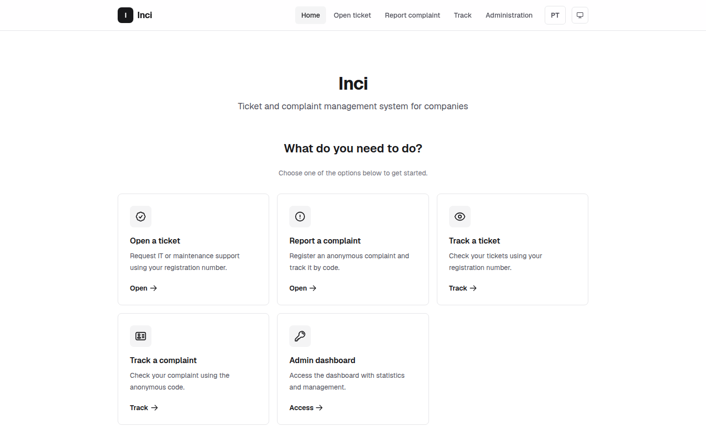
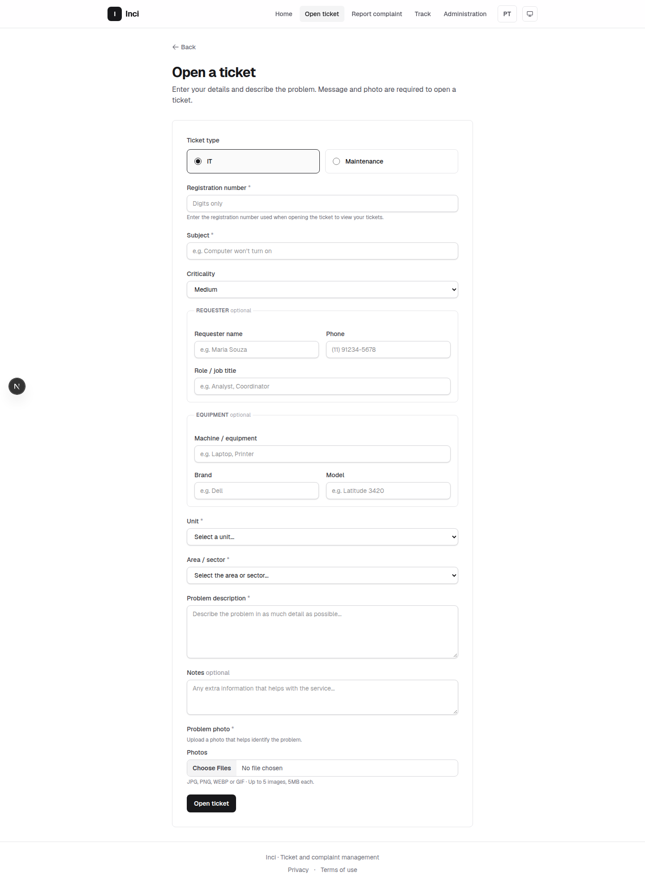
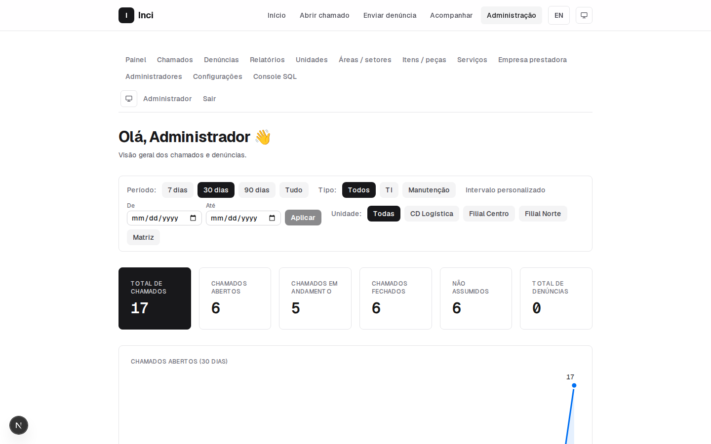
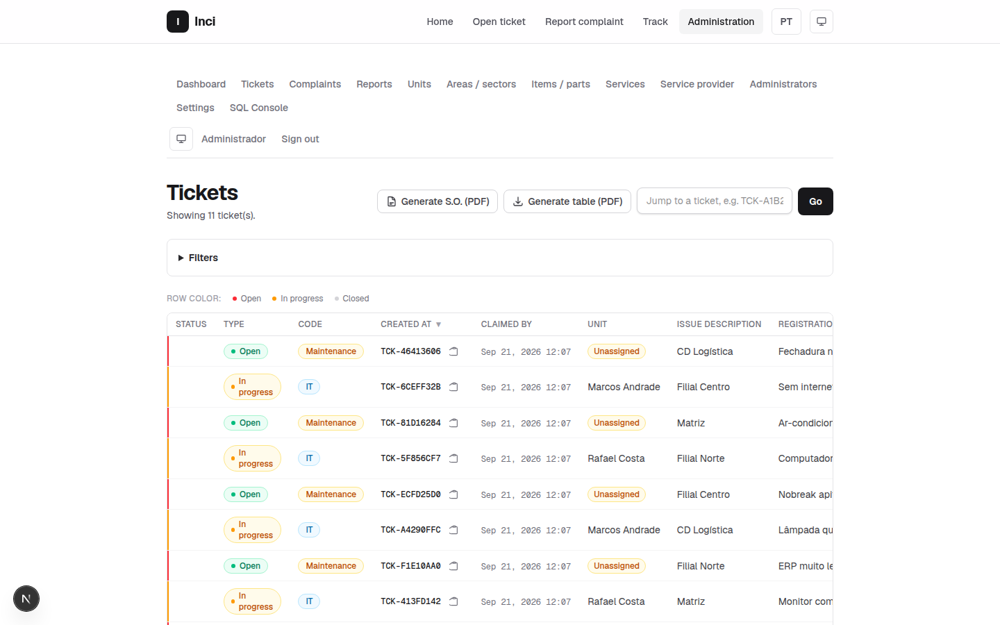
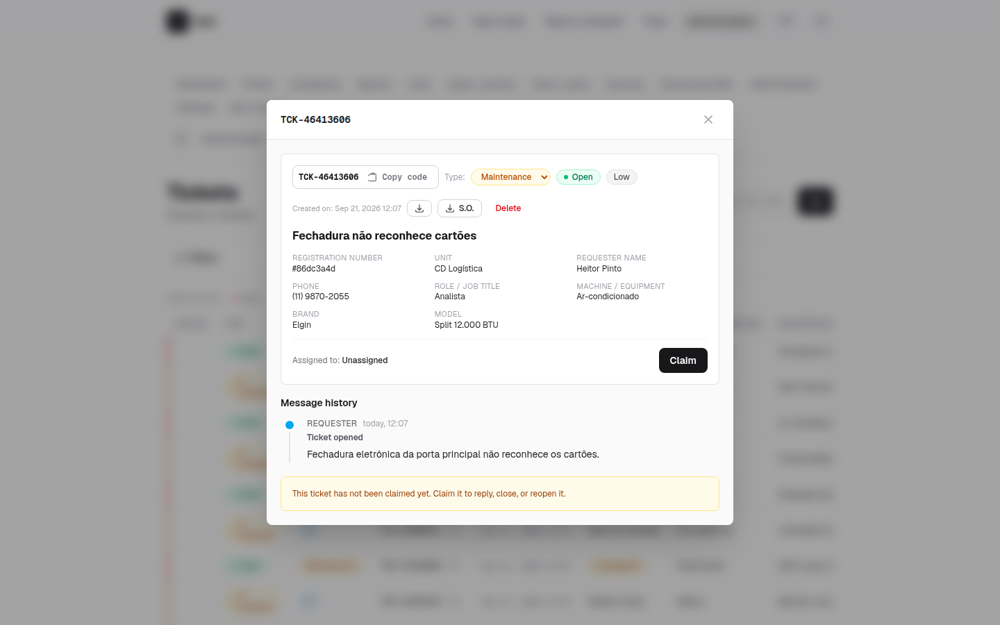
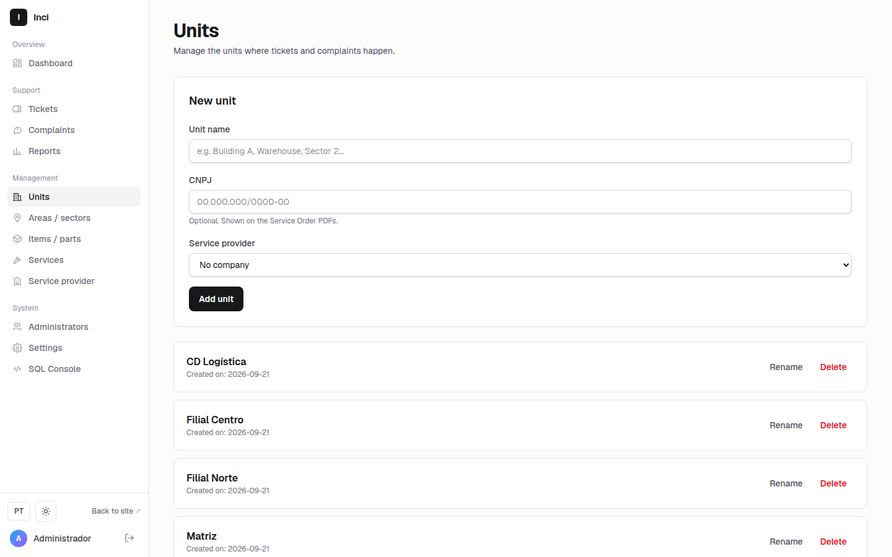
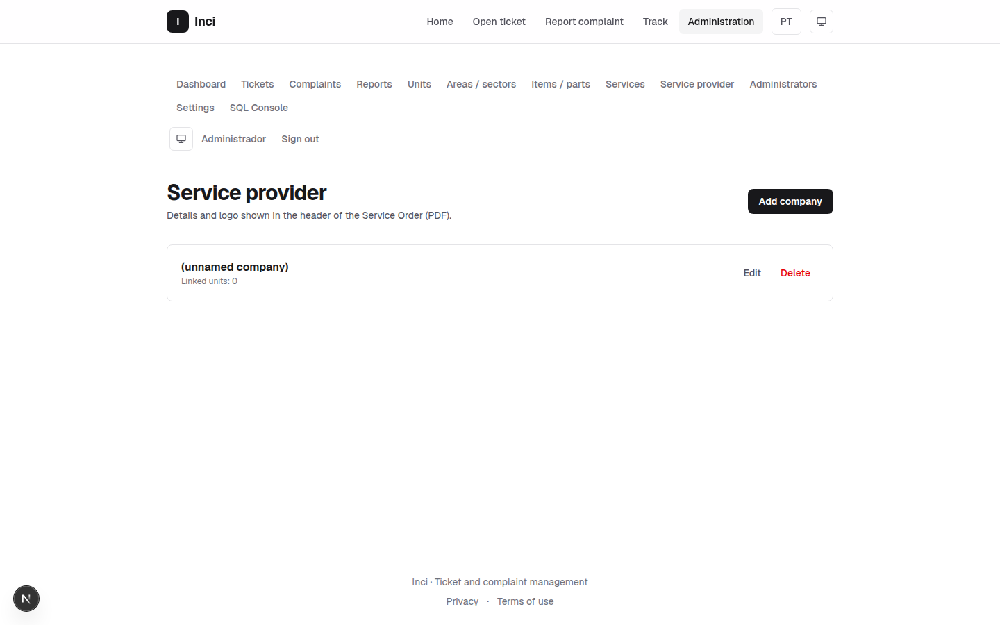
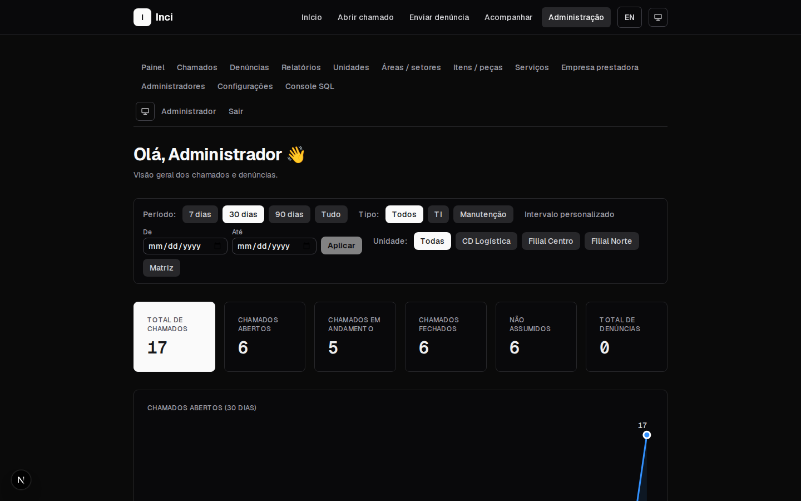

# Inci

Web system for **support tickets** (IT and maintenance) and **anonymous
complaints**, with an admin panel, tracking by matrícula (employee ID), and a
bilingual interface (Portuguese/English).

Built with [Next.js 16](https://nextjs.org) (App Router) + React 19 + TypeScript
+ Tailwind CSS 4.



## Features

### Public
- **New ticket** — opened with a matrícula, type (IT/maintenance), subject,
  description, and a required photo (up to 5 images, 5 MB each).
- **New complaint** — fully anonymous, optional photo; generates a tracking code
  (`DEN-XXXXXXXX-XXXX`).
- **Track ticket** — search by matrícula and a timeline with replies,
  opening/closing, and reply submission. Tickets opened before matrícula was
  adopted can still be found using the CPF used at the time.
- **Track complaint** — search by code, showing status, photos, replies, and
  anonymous follow-ups (blocked once closed).

### Admin (`/admin`)
- Login with an HMAC-signed session (`httpOnly` cookie).
- Dashboard with ticket and complaint statistics, filterable by period, type,
  and unit.
- Tickets: filtered listing, detail view, replies, type reassignment
  (IT/maintenance), open/close, and deletion (superadmin only).
- Complaints: listing, replies, and close/reopen (restricted to superadmins and
  admins with assigned complaints).
- PDF reports (tickets and complaints) with filters and configurable sections;
  the service order (O.S.) resolves the service-provider company from the
  ticket's unit.
- Units: manage the units where tickets and complaints occur, each of which can
  be linked to a service-provider company.
- Service-provider company: multiple companies can be registered, with their
  details and logo shown in the header of PDF service orders.
- Items and services: catalog with default prices, used to compute a ticket's
  total cost.
- Users: create/edit/delete administrators (superadmin only), with role and
  permissions (IT and maintenance).
- Settings: visual identity (logo) and the number of digits required for the
  matrícula when opening a new ticket (superadmin only).

## Identification by matrícula

Tickets are tracked by **matrícula** instead of CPF. Only an HMAC hash of the
matrícula is stored (`lib/matricula.ts`) — the raw value is never written to the
database, and admins only see an opaque reference (`#a1b2c3d4`), not the
matrícula itself. The required number of digits is configurable in
`/admin/settings` (default: 4); tickets opened before a settings change, or
before matrícula was adopted (when the system used CPF), can still be found
using their original identifier.

## Getting started

```bash
npm install
cp .env.example .env
npm run dev
```

Open [http://localhost:3000](http://localhost:3000). The root redirects to the
detected language (`/pt` or `/en`).

### Admin credentials

User: `admin` / Password: `admin123`

> The database is created automatically on first run with this superadmin user.
> **Change the default password before using in production.**

## Production build

```bash
npm install
cp .env.example .env   # configure the variables (see below)
npm run build
npm run start
```

The production server runs at [http://localhost:3000](http://localhost:3000).

## Environment variables

Copy `.env.example` to `.env` and adjust as needed. All variables are optional
in development.

| Variable                                   | Required   | Description                                                                                                                                              |
|--------------------------------------------|------------|----------------------------------------------------------------------------------------------------------------------------------------------------------|
| `SESSION_SECRET`                           | yes (prod) | Secret used to sign the admin session cookie and the matrícula hash. Falls back to a development value if unset. Use a random value in production.       |
| `NEXT_PUBLIC_DISABLE_COMPLAINTS`           | no         | `true`/`1`/`yes`/`on` disables the complaints module.                                                                                                    |
| `NEXT_PUBLIC_DISABLE_IT_TICKETS`           | no         | `true`/`1`/`yes`/`on` disables the IT tickets module.                                                                                                    |
| `NEXT_PUBLIC_DISABLE_MAINTENANCE_TICKETS`  | no         | `true`/`1`/`yes`/`on` disables the maintenance tickets module.                                                                                           |
| `COMPANY_NAME`, `COMPANY_CNPJ`, `COMPANY_ADDRESS`, `COMPANY_PHONE` | no | Values used to seed the first service-provider company on first boot, and as the data controller name on the privacy page. After first boot, edit the company at `/admin/company`. |

> **Warning:** changing `SESSION_SECRET` invalidates the hash of every stored
> matrícula — old tickets can no longer be found by matrícula until the original
> secret is restored. Set this value before the first production deploy and do
> not change it afterwards.

> `NEXT_PUBLIC_*` variables are embedded in the bundle at build time. Changing
> them requires running `npm run build` again.

## Persistence and uploads

Data is stored in a local SQLite database (`data/db.sqlite`, created
automatically) and uploaded photos in `data/uploads/`. The `data/` directory is
ignored by git.

To reset everything, just delete the `data/` folder — it is recreated and
re-seeded on the next run.

> The data layer is isolated in `lib/store.ts` (embedded SQLite via
> `node:sqlite`). To scale to multiple servers, consider switching to a
> client-server database.

## Structure

```
app/[lang]/            pages per language (public + admin)
app/uploads/[file]     serves uploaded images (with validation)
components/            UI components
dictionaries/          pt.json / en.json (translations)
docs/screenshots/      screenshots used in this README
lib/                   actions (server actions), auth, i18n, matrícula, store, types, uploads
proxy.ts               locale proxy (language redirect)
data/                  db.sqlite + uploads (ignored by git)
```

## Scripts

- `npm run dev` — development server (Turbopack)
- `npm run build` — production build
- `npm run start` — serve the production build
- `npm run lint` — ESLint

### Seeding the development database

Scripts in `scripts/` fill `data/db.sqlite` with sample data (do not use in
production). Run them with Node's type resolver:

```
node --experimental-strip-types --loader ./scripts/ts-resolve-hook.mjs scripts/seed-test-tickets.mjs
node --experimental-strip-types --loader ./scripts/ts-resolve-hook.mjs scripts/seed-full-ticket.mjs
```

- `seed-test-tickets.mjs` — creates units, areas, services, technicians, and ~16
  tickets.
- `seed-full-ticket.mjs` — creates a complete ticket (with O.S.) and the
  service-provider company.

## Screenshots

|  |  |
|---|---|
| **Open ticket** — matrícula, type, unit, area, and attachments | **Admin dashboard** — overview filterable by period, type, and unit |
|  |  |
| **Ticket list** — dense table with status, type, unit, and matrícula | **Ticket detail** — type reassignment, deletion, message history |
|  |  |
| **Units** — each can be linked to a service-provider company | **Service-provider companies** — multiple companies, shown on the PDF O.S. |
|  |  |

Dark mode:


